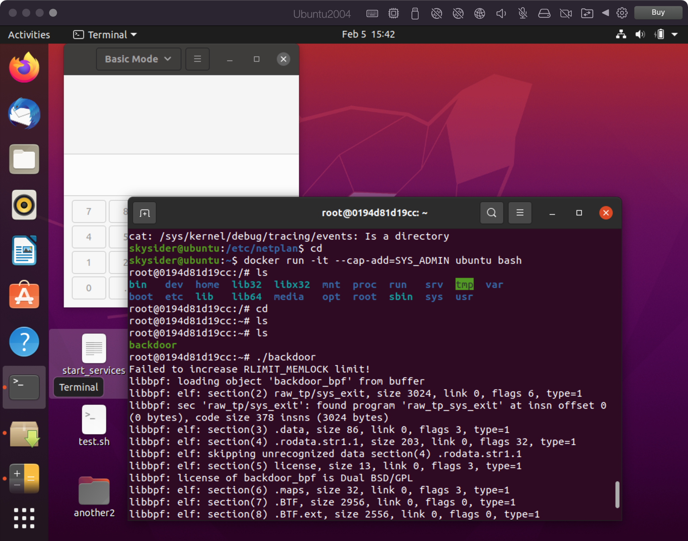

# eBPF docker逃逸
基于[libbpf](https://github.com/libbpf/libbpf-bootstrap/tree/master/examples/c)搭的

通过劫持openat stat fstat close read 这几个系统调用，实现劫持cron读取的/etc/crontab，欺骗宿主机中的cron执行攻击者预定的命令，实现逃逸

原理参考 [使用 eBPF 逃逸容器技术分析与实践](https://paper.seebug.org/1750)

效果如下：

